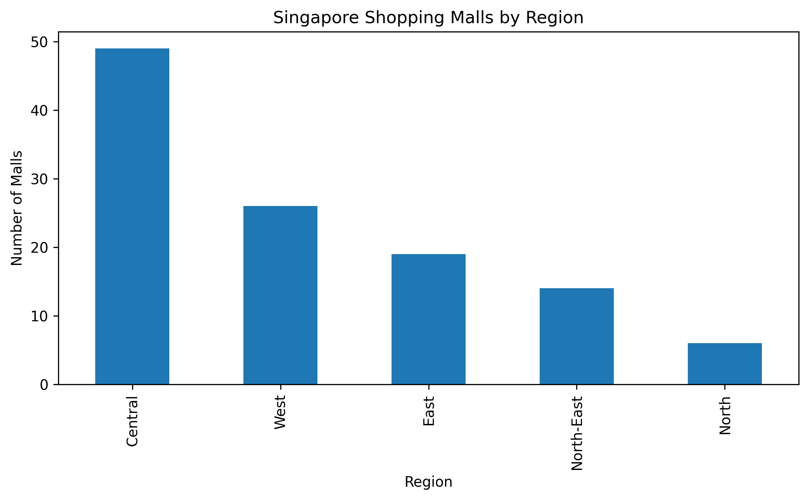

# Singapore Retail Location Intelligence

> A consulting-style market research project that demonstrates how publicly available retail location data can be collected, cleaned, and transformed into actionable business insights using **Python, BeautifulSoup, Pandas, and Matplotlib**.

## Business Objective

Commercial real estate and location consulting teams rely on structured market intelligence to evaluate retail clusters and support location strategy. This project demonstrates an automated workflow for collecting publicly available information on Singapore shopping malls and converting it into an analysis-ready dataset.

## Research Question

* Which regions of Singapore have the highest concentration of shopping malls?
* How can web scraping support location-based market research?
* How can publicly available data be transformed into reusable business intelligence assets?

## Tools Used

| Tool             | Purpose                  |
| ---------------- | ------------------------ |
| Python           | Data processing          |
| BeautifulSoup    | Web scraping             |
| Requests         | Data collection          |
| Pandas           | Data cleaning & analysis |
| Matplotlib       | Data visualization       |
| Jupyter Notebook | Workflow documentation   |

## Methodology

### 1. Data Collection

* Retrieved publicly available shopping mall information from Wikipedia using `requests`.
* Parsed HTML content with **BeautifulSoup**.
* Extracted shopping mall names together with their respective planning regions.

### 2. Data Cleaning

* Removed duplicate records.
* Standardized text formatting.
* Checked for missing values.
* Exported cleaned datasets into reusable CSV files.

### 3. Data Analysis

The cleaned dataset was analysed using Pandas to:

* Count shopping malls by region.
* Compare retail concentration across Singapore.
* Generate visual summaries for reporting.

## Dashboard Preview



## Key Findings

* **Central Singapore contains the highest concentration of shopping malls**, indicating the country's strongest retail cluster.
* **West and East Singapore also maintain significant retail activity**, suggesting commercial development extends beyond the central business district.
* The regional distribution provides a useful starting point for location-based market assessments and retail network comparisons.

## Business Recommendations

* Prioritize Central Singapore when evaluating high-density retail opportunities.
* Compare secondary retail clusters in the West and East for expansion potential.
* Expand future analysis by combining demographic, transport accessibility, and commercial property datasets for more comprehensive location intelligence.

## Repository Structure

```text
singapore-retail-location-intelligence/
├── data/
│   ├── singapore_malls_raw.csv
│   └── singapore_malls_cleaned.csv
├── notebooks/
│   └── singapore_retail_scraper.ipynb
├── screenshots/
│   └── malls_by_region.png
└── README.md
```

## Skills Demonstrated

* Web scraping with BeautifulSoup
* Data collection and collation
* Data cleaning and validation
* Exploratory data analysis (EDA)
* Market research
* Business insight generation
* Workflow documentation
* Python automation
